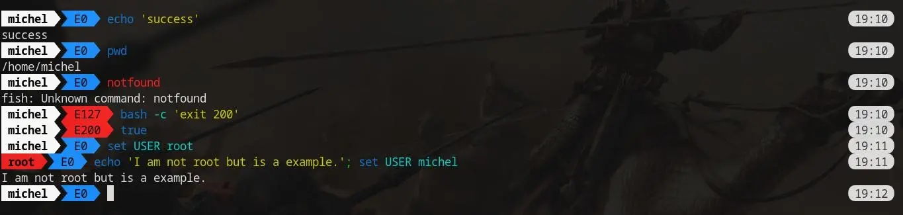

# Prettyline

[](https://opensource.org/license/mit)


Prettyline customizes any shell prompt with a static style.

|  |
| :-----------------------------------------------: |
|                *Prettyline v0.3.0*                |

## Build and installation:

You need to have the following programs on your system:
  - git (probably already have it)
  - [The Rust compiler](https://www.rust-lang.org/es/learn/get-started)

### Manual way:

#### Download and build
```bash
git clone 'https://github.com/michelnovus/prettyline'
cd prettyline/prettyline
cargo build --release
```
Now the program excecutable is located in `target/release/prettyline`.
This excecutable should go in your `PATH`, see bellow.

#### Installation
- In your `/home`:
```bash
cp target/release/prettyline ~/.local/bin/
```

- Or in your system:
```bash
sudo cp target/release/prettyline /usr/local/bin/
```

> [!NOTE]
> Normally a program will be available to all users of the system if it is 
> installed in `/usr/local/bin`, except for the `root` user. To solve this,
> i create a symlink from the program in `/usr/local/bin` to 
> `/usr/bin`.
>
> ```bash
> sudo ln -s /usr/local/bin/prettyline /usr/bin/prettyline
> ```

#### Initialization

Once the program is installed, place the following line in the main shell 
configuration file: `eval "$(prettyline --shell SHELLNAME --init)"`[^1]
- **Bash**: `eval "$(prettyline --shell bash --init)"` in `~/.bashrc` or `/etc/bash.bashrc`
- **Zsh**: `eval "$(prettyline --shell zsh --init)"` in `~/.zshrc` or `/etc/zsh/zshrc`
- **Fish**: `eval "$(prettyline --shell fish --init)"` in `~/.config/fish/config.fish` 
  or `/etc/fish/config.fish`

[^1]: *prettyline* binary is expected to be in the *PATH*, anyway you 
can change *prettyline* binary for: */absolute/path/to/prettyline*
